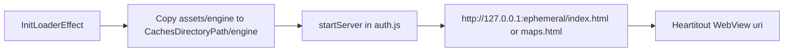

# Native static HTTP server — plan and implementation

This document records the **original plan** and **what was implemented** in this repository. It replaces the former `@dr.pogodin/react-native-static-server` dependency with an in-house native static file server.

---

## Why not Express (or Node) in the app

React Native runs JavaScript on Hermes/JSC, not Node.js. There is no `http.createServer` in the RN JS runtime, and Express cannot run inside the app bundle. Serving local HTML/CSS/JS to `WebView` over `http://127.0.0.1:…` requires a **native** TCP/HTTP listener on Android and iOS (or alternatively `file://` URLs in WebView, which was not chosen for this project).

---

## Behavior preserved (same as before)

| Aspect | Detail |
|--------|--------|
| **Document root** | `RNFS.CachesDirectoryPath + '/engine'` (aligned with [`src/components/Loader/InitLoaderEffect.js`](src/components/Loader/InitLoaderEffect.js)) |
| **Port** | `0` → OS assigns an ephemeral port |
| **Binding** | `localOnly: true` → loopback only (`127.0.0.1`), not LAN |
| **URLs returned** | `…/index.html` or `…/maps.html` from [`src/utils/auth.js`](src/utils/auth.js) |
| **WebView** | [`src/screens/Utilities/Web/Heartitout.js`](src/screens/Utilities/Web/Heartitout.js) uses `source={{ uri: link }}` and calls `stopServer()` on navigation blur |

**Fix included:** `stopServer` now calls the native `stop()` implementation so the listener thread and socket are released (previously the stop path was effectively a no-op).

---

## Implemented architecture

### Local npm package

| Item | Location |
|------|----------|
| Package | [`modules/LocalStaticServer/`](modules/LocalStaticServer/) |
| Root dependency | [`package.json`](package.json) — `"local-static-server": "file:./modules/LocalStaticServer"` |
| JS API | [`modules/LocalStaticServer/index.js`](modules/LocalStaticServer/index.js) |
| Android autolinking | [`modules/LocalStaticServer/react-native.config.js`](modules/LocalStaticServer/react-native.config.js) |
| iOS CocoaPods | [`modules/LocalStaticServer/LocalStaticServer.podspec`](modules/LocalStaticServer/LocalStaticServer.podspec) (at package root so RN discovers it) |

### JavaScript API

- **`start({ rootPath, port = 0, localOnly = true })`** → `Promise<string>` resolving to `http://127.0.0.1:<port>` (or `http://0.0.0.0:<port>` if `localOnly` were false on native).
- **`stop()`** → `Promise<void>`; idempotent.

[`src/utils/auth.js`](src/utils/auth.js) imports `start` / `stop` as `startLocalServer` / `stopLocalServer` and keeps the existing `startServer` / `stopServer` context API for [`src/screens/Home/Home_Old.js`](src/screens/Home/Home_Old.js) and [`src/navigation/Home/BottomTabs.js`](src/navigation/Home/BottomTabs.js).

### Android (Kotlin, no extra Maven dependencies)

| File | Role |
|------|------|
| [`StaticHttpServer.kt`](modules/LocalStaticServer/android/src/main/java/com/classlocator/localstaticserver/StaticHttpServer.kt) | `ServerSocket` on background thread; GET only; path canonicalization under root; `..` traversal blocked; common MIME types; streams file body |
| [`LocalStaticServerModule.kt`](modules/LocalStaticServer/android/src/main/java/com/classlocator/localstaticserver/LocalStaticServerModule.kt) | `ReactContextBaseJavaModule` — `start`, `stop` |
| [`LocalStaticServerPackage.kt`](modules/LocalStaticServer/android/src/main/java/com/classlocator/localstaticserver/LocalStaticServerPackage.kt) | `ReactPackage` registration |
| [`android/build.gradle`](modules/LocalStaticServer/android/build.gradle) | Library module depending on `react-android` |

### iOS (Swift + Objective-C bridge)

| File | Role |
|------|------|
| [`TinyHTTPServer.swift`](modules/LocalStaticServer/ios/TinyHTTPServer.swift) | Minimal HTTP/1.1 static server (Darwin sockets); same security and MIME ideas as Android |
| [`LocalStaticServer.swift`](modules/LocalStaticServer/ios/LocalStaticServer.swift) | Native module implementation; serial queue for start/stop |
| [`LocalStaticServer.m`](modules/LocalStaticServer/ios/LocalStaticServer.m) | `RCT_EXTERN_MODULE` exports |

### New Architecture note

The app has `newArchEnabled=true` on Android. The module is implemented as a **classic native module** (`ReactContextBaseJavaModule` / RCT bridge). RN’s legacy-module interop is expected to load it; if you hit linking issues on a future RN upgrade, migrate to a Turbo Module spec while keeping the same server code.

---

## Verification checklist

- [ ] After `InitLoaderEffect` copies assets, open maps from home and from shared deep links; confirm `index.html` / `maps.html` and relative `assets/…` load.
- [ ] Leaving the WebView screen stops the server (no leaked port/thread).
- [ ] With `localOnly: true`, the server should not accept connections from the LAN interface.

**Android:** `./gradlew :app:assembleDebug` (or `run-android`) should compile the `:local-static-server` library.

**iOS:** From the project root, run `cd ios && pod install`, then build in Xcode.

---

## Removed dependency

- **`@dr.pogodin/react-native-static-server`** — removed from [`package.json`](package.json); lockfile updated via `npm install`.

---

## Optional follow-ups (not implemented)

- Reuse a single long-lived server and fixed port to reduce start/stop churn.
- Align MIME detection with platform helpers (e.g. Android `MimeTypeMap`) for edge extensions.
